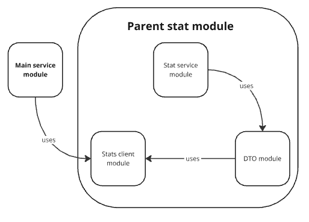

# Этап 1. Сервис статистики

На этом этапе требуется реализовать сервис статистики. Спланировать архитектуру и контракты сервисов. Настроить систему
контроля версий, разделить разработку на ветки. Настроить базу данных и миграции.

- Реализовать сервис статистики в соответствии со спецификацией [stats-service-spec.json](..%2Fspecifications%2Fstats-service-spec.json);
- Реализовать HTTP-клиент для работы с сервисом статистики;
- Подготовить сборку проекта;
- Написать Postman-тесты для проверки работы функциональности;

***

Разработка данного функционала будет вестись в ветке c именем **stat_svc**.

## Подготовка сборки проекта

Приложение должно состоять из двух отдельно запускаемых сервисов — в контексте сборки проекта при помощи Maven это
означает, что проект будет многомодульным. Сами сервисы можно также разбить на подмодули. \
Сервис статистики должен состоять из HTTP-сервиса и HTTP-клиента. Это значит, что модуль статистики можно разделить на
два подмодуля.
Механизм взаимодействия сервиса и клиента предполагает, что они будут использовать одни и те же объекты для запросов и
ответов. Исходя из этого, можно выделить еще один подмодуль, в котором будут размещены общие классы DTO.
Структуру модулей и зависимостей можно представить в виде такой схемы.

Модули основного сервиса и сервиса статистики должны содержать dockerfile. В корне проекта должен быть создан файл
docker-compose.yml, описывающий запуск контейнеров с сервисами проекта и базами данных для них.
Файл pom.xml, описывающий сборку основного сервиса, на данном этапе должен содержать только указание на родительский
модуль и идентификатор артефакта.